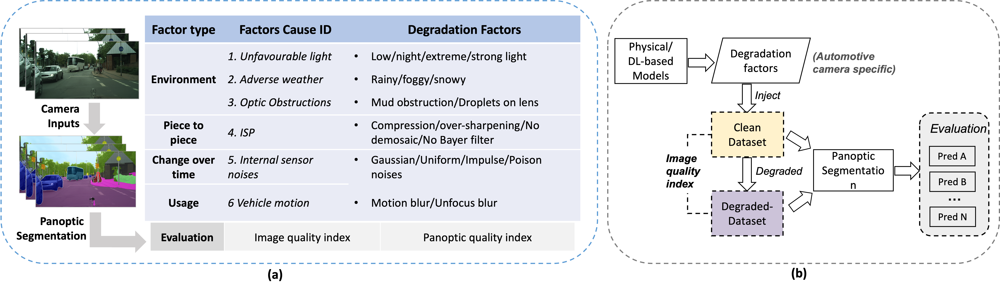

# BRPS
# Benchmarking-the-Robustness-of-Panoptic-Segmentation-for-Automated-Driving

This is the **PyTorch re-implementation** of our aiXiv paper: 
Benchmarking the Robustness of Panoptic Segmentation for Automated Driving, [link](). 

- **New robustness dataset**: **Degraded-Cityscapes+ (D-Cityscapes+)** (New model for snow and unfavourable light)
- **Unifying degradation pipeline**: unifying pipeline to assess the robustness of panoptic segmentation models for assisted and automated driving (AAD) systems, correlating it with image quality.
- **Benchmarking experiments**: 3 state-of-the-art CNN- and transformer-based panoptic segmentation networks are used to compare their robustness.

## Requirements
Here, we show examples of using the EfficeintPS, DeepLab, and Oneformer for the Cityscape dataset. 
- Requirement for EfficientPS is from [here](https://github.com/DeepSceneSeg/EfficientPS#system-requirements).
- Requirement for DeepLab is from [here](https://github.com/bowenc0221/panoptic-deeplab/blob/master/tools_d2/README.md).
- Requirement for Oneformer is from [here](https://github.com/SHI-Labs/OneFormer).
- Download the Cityscape validation [here](https://mega.nz/folder/tS8QSaxL#5yhdfe9ogpKk18dRwX7WCw](https://www.cityscapes-dataset.com/downloads/)https://www.cityscapes-dataset.com/downloads/).

## Datasets Generation and Downloading
| Degradation Factor      | Implementation Details    | Download |
|-------------|------------|----------|
| Low light  | Apply the inverse of the DL-based curve estimation image enhancement method (EC-Zero-DCE) | [Link](?)|
| Night light | Retrain the CyCleGAN network with the BDD100K dataset |[Link](?)|
